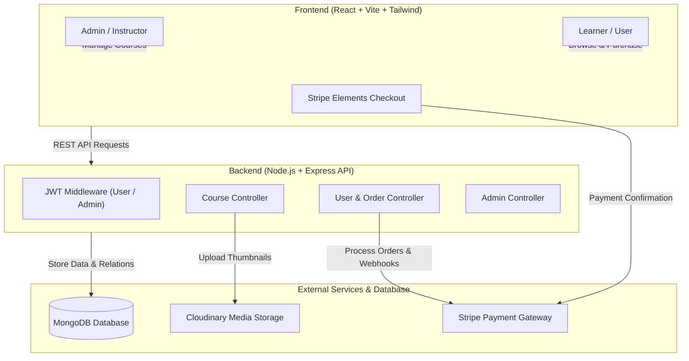

# 🎓 Course Selling Platform (MERN Stack)

[](https://react.dev/)
[](https://vitejs.dev/)
[](https://tailwindcss.com/)
[](https://nodejs.org/)
[](https://www.mongodb.com/)
[](https://stripe.com/)
[](https://cloudinary.com/)

A modern, full-featured Course Selling and Learning Management web application built with the **MERN** stack (MongoDB, Express, React, Node.js). It provides an intuitive interface for students to browse and purchase courses with Stripe integration, alongside a dedicated Admin Portal for course creators to upload, edit, and manage their curriculum and digital assets.

---

## 📑 Table of Contents

- [Features](#-features)
  - [For Students / Learners](#for-students--learners)
  - [For Admins / Instructors](#for-admins--instructors)
- [Tech Stack](#-tech-stack)
- [Architecture & Workflow](#-architecture--workflow)
- [Project Structure](#-project-structure)
- [Environment Variables](#-environment-variables)
- [Getting Started](#-getting-started)
  - [Prerequisites](#prerequisites)
  - [1. Clone Repository](#1-clone-repository)
  - [2. Backend Setup](#2-backend-setup)
  - [3. Frontend Setup](#3-frontend-setup)
  - [4. Database Seeding (Optional)](#4-database-seeding-optional)
- [API Endpoints](#-api-endpoints)
- [Deployment](#-deployment)
- [Contributing](#-contributing)
- [License](#-license)

---

## ✨ Features

### For Students / Learners
- 🔐 **Authentication**: User registration and secure login with JWT authentication.
- 📚 **Explore Courses**: Interactive course catalog with dynamic search, filters, pricing, and detailed course outlines.
- 💳 **Seamless Payments**: Secure checkout powered by **Stripe API**.
- 📦 **My Purchases**: Dedicated student dashboard to view and access enrolled courses.
- 🔔 **Instant Feedback**: Toast notifications for cart actions, purchases, and authentication state.

### For Admins / Instructors
- 🛡️ **Dedicated Admin Auth**: Separate credentials and authentication guard for instructor/admin actions.
- ➕ **Course Creation**: Create courses with titles, descriptions, pricing, and thumbnail uploads via **Cloudinary**.
- ✏️ **Course Management**: Update curriculum details, adjust prices, change thumbnails, or delete courses.
- 📊 **Admin Dashboard**: Overview of all courses published on the platform.

---

## 🛠 Tech Stack

### Frontend
- **Framework**: [React 18](https://react.dev/) + [Vite](https://vitejs.dev/)
- **Routing**: [React Router DOM v7](https://reactrouter.com/)
- **Styling**: [Tailwind CSS](https://tailwindcss.com/)
- **Icons**: [React Icons](https://react-icons.github.io/react-icons/)
- **Slider/Carousel**: [React Slick](https://react-slick.neostack.com/) & Slick Carousel
- **Payments**: [@stripe/stripe-js](https://stripe.com/docs/js) & [@stripe/react-stripe-js](https://stripe.com/docs/stripe-js/react)
- **HTTP Client**: [Axios](https://axios-http.com/)
- **Notifications**: [React Hot Toast](https://react-hot-toast.com/)

### Backend
- **Runtime**: [Node.js](https://nodejs.org/) (ES Modules)
- **Framework**: [Express.js](https://expressjs.com/)
- **Database**: [MongoDB](https://www.mongodb.com/) via [Mongoose ODM](https://mongoosejs.com/)
- **Authentication**: [JSON Web Tokens (JWT)](https://jwt.io/) & [Bcrypt.js](https://www.npmjs.com/package/bcryptjs)
- **File & Media Storage**: [Cloudinary](https://cloudinary.com/) with `express-fileupload`
- **Payments**: [Stripe Node SDK](https://stripe.com/docs/api)
- **Validation**: [Zod](https://zod.dev/)

---

## 🏗 Architecture & Workflow



---

## 📁 Project Structure

```text
CourseSellingSite/
├── backend/
│   ├── controllers/         # Business logic for admin, user, course, order
│   ├── middlewares/         # JWT authentication guards (user.mid.js, admin.mid.js)
│   ├── models/              # Mongoose database schemas (User, Admin, Course, Order, Purchase)
│   ├── routes/              # Express API route declarations
│   ├── config.js            # Configuration & environment export
│   ├── index.js             # Express app entrypoint & middleware setup
│   ├── seed.js              # Database seed script for mock data & demo admin
│   └── package.json
│
├── frontend/
│   ├── public/              # Static assets
│   ├── src/
│   │   ├── admin/           # Admin views (Login, Signup, Dashboard, Create/Update Course)
│   │   ├── assets/          # Images and SVG assets
│   │   ├── components/      # User views (Home, Courses, Buy, Purchases, Login, Signup)
│   │   ├── utils/           # API configuration and constants
│   │   ├── App.jsx          # Route definitions & Toast configuration
│   │   ├── main.jsx         # React DOM root entry
│   │   └── index.css        # Global CSS & Tailwind directives
│   ├── index.html
│   ├── tailwind.config.js   # Tailwind theme customization
│   ├── vite.config.js       # Vite configuration
│   └── package.json
│
├── .gitignore
├── example .env             # Environment template
└── README.md
```

---

## 🔑 Environment Variables

Create `.env` files in your **backend** directory (or root) based on the template below:

### Backend `.env`

```env
PORT=4001
FRONTEND_URL=http://localhost:5173
MONGO_URI=mongodb+srv://<username>:<password>@cluster.mongodb.net/courses-app?retryWrites=true&w=majority

# Cloudinary Credentials (for Course Thumbnails)
cloud_name=your_cloudinary_cloud_name
api_key=your_cloudinary_api_key
api_secret=your_cloudinary_api_secret

# JWT Secrets
JWT_USER_PASSWORD=your_super_secret_user_jwt_key
JWT_ADMIN_PASSWORD=your_super_secret_admin_jwt_key

# Stripe Payment Secret Key
STRIPE_SECRET_KEY=sk_test_your_stripe_secret_key

# Environment
NODE_ENV=development
```

---

## 🚀 Getting Started

### Prerequisites
- [Node.js](https://nodejs.org/) (v18 or higher recommended)
- [npm](https://www.npmjs.com/) or [yarn](https://yarnpkg.com/)
- [MongoDB](https://www.mongodb.com/) (Local instance or MongoDB Atlas cluster)
- [Cloudinary Account](https://cloudinary.com/) (Free tier)
- [Stripe Account](https://stripe.com/) (Test mode keys)

---

### 1. Clone Repository

```bash
git clone https://github.com/manishsambari/CourseSellingSIte.git
cd CourseSellingSIte
```

---

### 2. Backend Setup

1. Navigate to the `backend` directory:
   ```bash
   cd backend
   ```
2. Install dependencies:
   ```bash
   npm install
   ```
3. Create a `.env` file with your credentials (see [Environment Variables](#-environment-variables)).
4. Start the development server:
   ```bash
   npm start
   ```
   *The backend will start on `http://localhost:4001` (or your configured `PORT`).*

---

### 3. Frontend Setup

1. Open a new terminal and navigate to the `frontend` directory:
   ```bash
   cd frontend
   ```
2. Install dependencies:
   ```bash
   npm install
   ```
3. Update backend API endpoint in `src/utils/utils.js` if running locally:
   ```javascript
   export const BACKEND_URL = "http://localhost:4001/api/v1";
   ```
4. Start the Vite development server:
   ```bash
   npm run dev
   ```
   *The frontend will run at `http://localhost:5173`.*

---

### 4. Database Seeding (Optional)

To quickly populate the database with sample courses and a pre-configured admin account:

```bash
cd backend
npm run seed
```

---

## 📡 API Endpoints

### 👤 User Endpoints (`/api/v1/user`)
| Method | Endpoint | Description | Access |
| :--- | :--- | :--- | :--- |
| `POST` | `/api/v1/user/signup` | Register new student | Public |
| `POST` | `/api/v1/user/login` | Authenticate student | Public |
| `GET` | `/api/v1/user/logout` | Clear user session / cookie | User |
| `GET` | `/api/v1/user/purchases` | Get all purchased courses | User |

### 🛡️ Admin Endpoints (`/api/v1/admin`)
| Method | Endpoint | Description | Access |
| :--- | :--- | :--- | :--- |
| `POST` | `/api/v1/admin/signup` | Register new admin/creator | Public |
| `POST` | `/api/v1/admin/login` | Authenticate admin | Public |
| `GET` | `/api/v1/admin/logout` | Clear admin session / cookie | Admin |

### 📖 Course Endpoints (`/api/v1/course`)
| Method | Endpoint | Description | Access |
| :--- | :--- | :--- | :--- |
| `GET` | `/api/v1/course/courses` | Fetch all available courses | Public |
| `GET` | `/api/v1/course/:courseId` | Fetch single course details | Public |
| `POST` | `/api/v1/course/create` | Create a new course (with image) | Admin |
| `PUT` | `/api/v1/course/update/:courseId` | Update course information | Admin |
| `DELETE`| `/api/v1/course/delete/:courseId` | Delete a course | Admin |
| `POST` | `/api/v1/course/buy/:courseId` | Initiate course purchase | User |

### 💳 Order Endpoints (`/api/v1/order`)
| Method | Endpoint | Description | Access |
| :--- | :--- | :--- | :--- |
| `POST` | `/api/v1/order` | Record order and verify payment | User |

---

## 🌐 Deployment

### Frontend (e.g., Vercel / Netlify)
- Set build command: `npm run build`
- Set output directory: `dist`
- Configure `vercel.json` for client-side single page app (SPA) routing.

### Backend (e.g., Render / Railway / Heroku)
- Set build command: `npm install`
- Set start command: `node index.js`
- Configure environment variables in the host dashboard.

---

## 🤝 Contributing

Contributions, issues, and feature requests are welcome!

1. Fork the repository
2. Create your feature branch (`git checkout -b feature/AmazingFeature`)
3. Commit your changes (`git commit -m 'Add some AmazingFeature'`)
4. Push to the branch (`git push origin feature/AmazingFeature`)
5. Open a Pull Request

---

## 📄 License

This project is licensed under the [ISC License](LICENSE).
